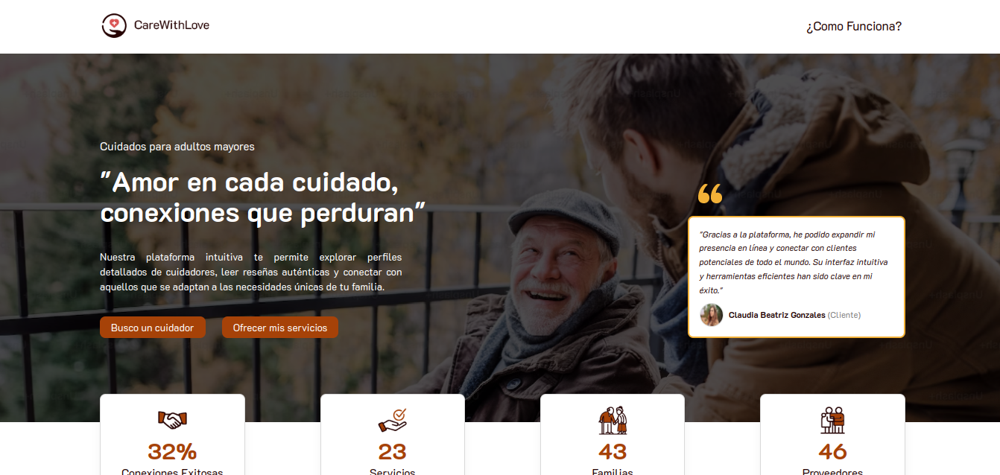
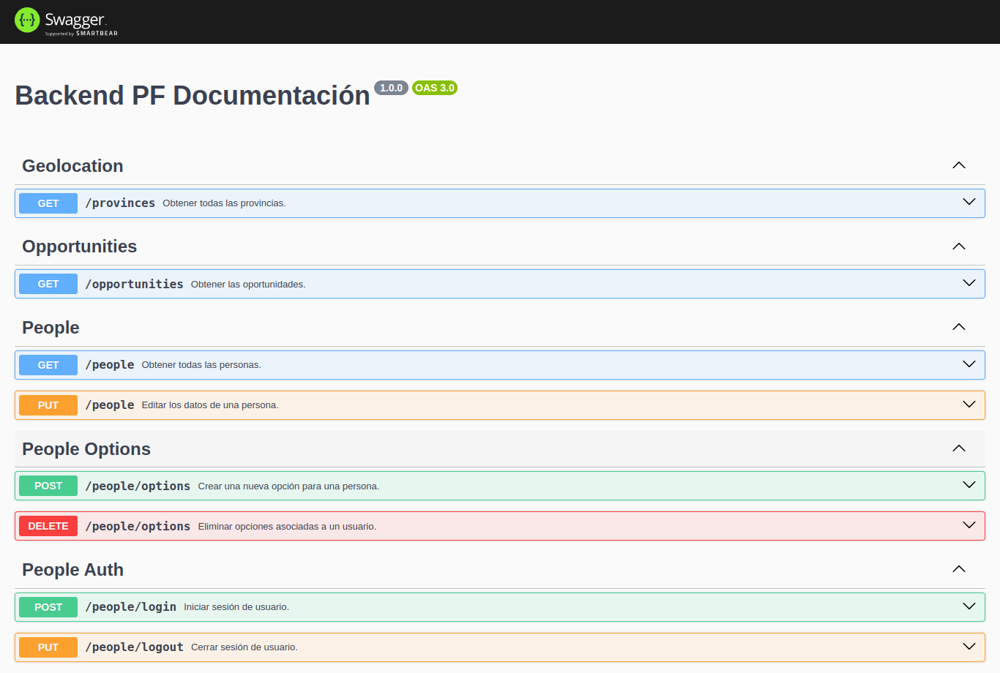

#Proyecto Final

## Plataforma de Pasantias para la Universidad del Norte Santo Tomas de Aquino

### En primer lugar, dale una estrella a nuestro repositorio 🌟
Plataforma de Pasantias para la Universidad del Norte Santo Tomas de Aquino, proporcionando una experiencia transparente y eficiente.
Proyecto academico

## Contenido

- [Features](#features)
- [Demo](#demo)
- [Instalación](#instalación)
- [License](#license)
- [Contacto](#contacto)

## Features

- Autenticación local.
- Creación de perfiles para los proveedores.
- Creación de perfiles para los clientes.
- Upload de imagenes (Cloudinary).
- Sistema de calificación y reseñas en los perfiles de proveedores.
- Panel del administrador para gestionar usuarios y notificaciones.
- Filtros por valor de servicio, valoración, especialida, ubicación y otras propiedades.

## Demo





## Instalación

Para ejecutar esta API localmente, sigua los siguientes pasos:

1. Clone este repositorio:

```bash
git clone URL

```

2. Configura los datos de conección con la base de datos PostgreSQL en el archivo .env .

3. Abra el proyecto en el terminal y ejecute los comandos:

```bash
npm install
npm start
```

## License

Este proyecto tiene la licencia MIT - consulte el archivo [LICENCIA](/LICENCIA) para obtener más detalles.

## Contacto

Puedes contactar a los desarrolladores via Linkedin:
- Leandro Herrera [linkedin](https://www.linkedin.com/in/leandroherrera1002/)
